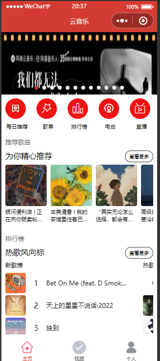
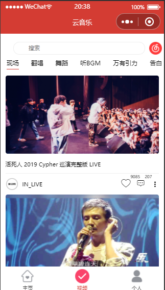
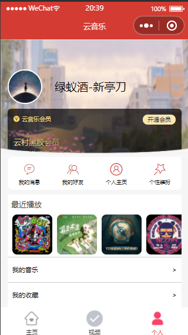
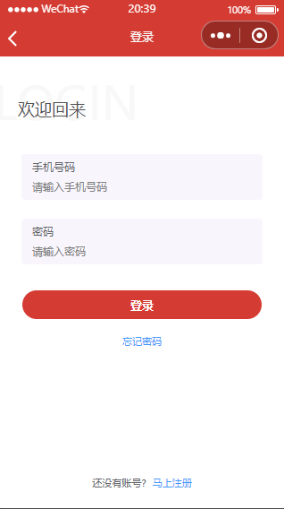
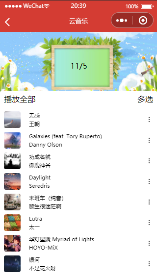
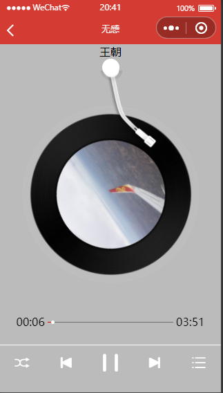

# 云音乐

## 登录

> 登录验证
> 
> -  收集表单数据 
> 
> -  前端验证
>   
>   - 验证信息是否合法 
>   
>   - 验证通过发送请求给服务端（携带数据）
> 
> - 后端验证
>   
>   - 收到后端返回验证信息提示用户
>   
>   - 验证成功，获取信息和保存cookie

## 视频页面

> 多个视频同时播放
> 
> - 点击下一个视频是将上一个视频停止
> 
> - 单例模式
>   
>   - 创建一个视频播放上下文变量用于表示当前播放的视频
>   
>   - 当点击下一个视频时让该变量指向下一个视频 
> 
> 记录视频播放进度
> 
> - 创建数组存放播放过的视频标识和进度的对象
> 
> - 当点击时通过视频标识确认是否有播放进度

## 歌曲播放

> 页面通讯
> 
> -   使用第三方库PubSub
> 
> - <mark>消息订阅与发布 </mark>
> 
> 音乐播放
> 
> -    动画状态和歌曲播放状态的一致
>   
>   - 监听歌曲播放的状态修改变量影响页面动画和页面展示 
> 
> - 切换歌曲
>   
>   - 使用页面通讯获取推荐页面的歌曲数据进行页面歌曲切换

